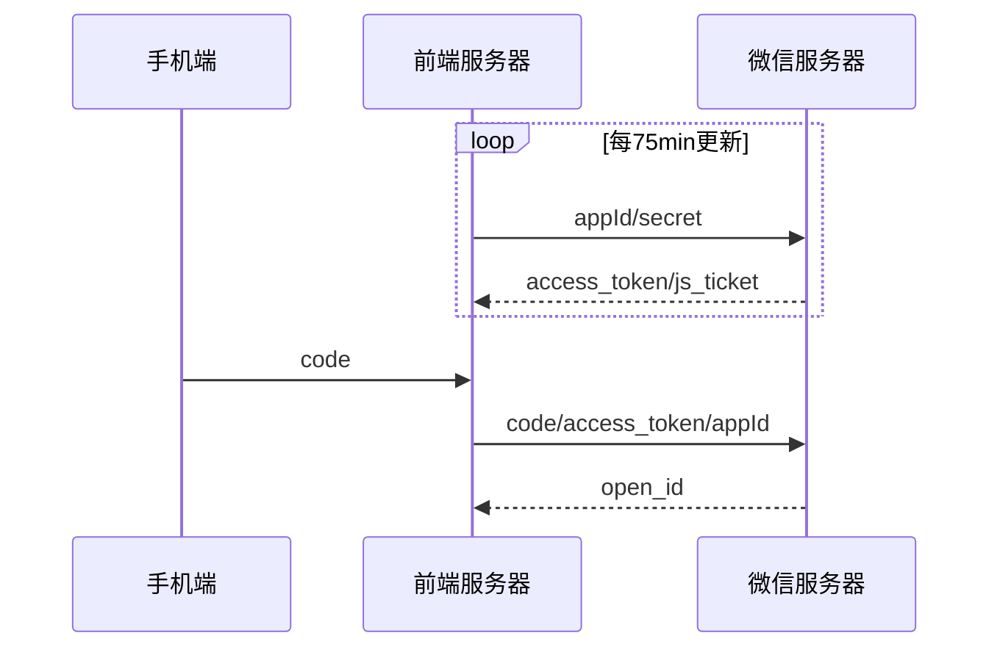
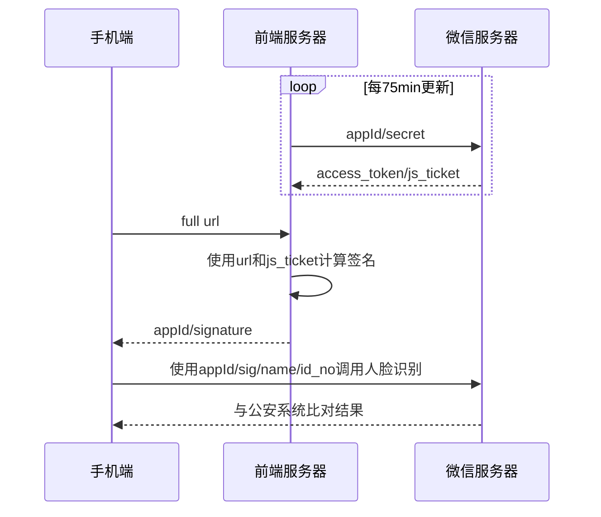
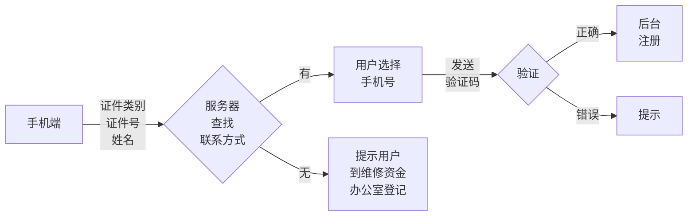
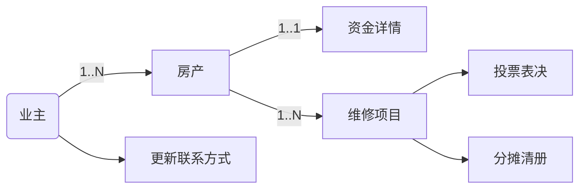
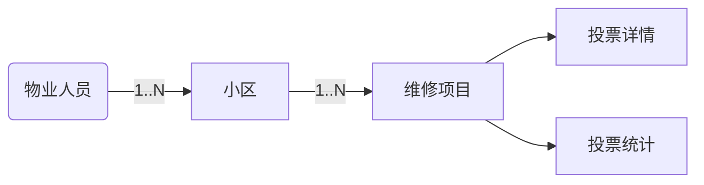
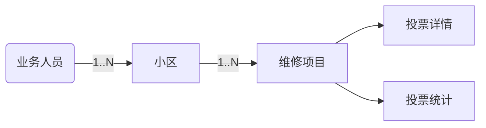

# 质量9000文档进度记录

## 1. 计划部分

### ~~01 立项报告~~
- 页数：8
- 内容：功能描述/技术指标/项目计划
- 预估：2 hour

### ~~02 开发计划~~
- 页数：8
- 内容：项目描述/开发环境/具体开发阶段界定
- 预估：1 hour

### ~~03 配置管理计划~~
- 页数：4
- 内容：简单
- 预估：0.5 hour

### ~~04 质量保证计划~~
- 页数：4
- 内容：简单
- 预估：0.5 hour

### ~~05 设计评审表~~
- 页数：4
- 内容：简单
- 预估：0.5 hour

## 2. 需求部分

### ~~06 需求分析说明书~~
- 页数：8
- 内容：功能描述/技术指标/项目计划
- 注意：需要与02开发计划保持一致
- 预估：2 hour

### ~~07 需求评审记录~~
- 页数：2
- 内容：简单
- 预估：0.5 hour

## 3. 设计部分

### ~~08 概要设计说明书~~
- 页数：6
- 内容：系统说明/构架图 主要是图
- 预估：2 hour

```mermaid
graph TD
A[用户认证模块] --> B[权限管理模块]
B --> C[业主功能模块]
B --> D[业务人员<br>功能模块]
B --> E[业务领导<br>功能模块]
B --> F[物业人员<br>功能模块]

graph LR
A[手机端] --- |认证|B[前端服务器]
B --- |鉴权|C[微信服务器]
A --- |鉴权后|D[后台服务器]
D --- |访问|E[内网数据库]
```

### ~~09 软件产品设计评审表~~
- 页数：2
- 内容：简单
- 预估：0.5 hour

### ~~10 详细设计说明书~~
- 页数：36
- 内容：模块设计详细说明
- 预估：5 hour

获取open_id


人脸识别


短信流程


业主模块


物业模块


业务模块


### ~~11 详细设计评审记录~~
- 页数：2
- 内容：简单
- 预估：0.5 hour

## 4. 测试部分

### ~~12 测试计划~~
- 页数：6
- 内容：背景/测试阶段性计划
- 预估：1 hour

### ~~13 测试计划评审记录~~
- 页数：2
- 内容：简单
- 预估：0.5 hour

### 14 测试用例
- 页数：34
- 内容：非常多，应要按模板来
- 预估：6 hour

### ~~17 测试报告~~
- 页数：5
- 内容：测试结果
- 预估：1 hour

### ~~使用手册~~
- 注意：需要看是否根据模板修改
- 页数：28
- 预估：1 hour
