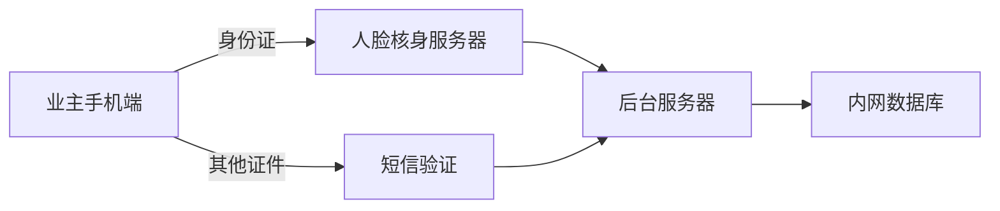

# 质量9000文档进度记录

## 1. 计划部分

### ~~01 立项报告~~
- 页数：8
- 内容：功能描述/技术指标/项目计划
- 预估：2 hour

### ~~02 开发计划~~
- 页数：8
- 内容：项目描述/开发环境/具体开发阶段界定
- 预估：1 hour

### ~~03 配置管理计划~~
- 页数：4
- 内容：简单
- 预估：0.5 hour

### ~~04 质量保证计划~~
- 页数：4
- 内容：简单
- 预估：0.5 hour

### ~~05 设计评审表~~
- 页数：4
- 内容：简单
- 预估：0.5 hour

## 2. 需求部分

### ~~06 需求分析说明书~~
- 页数：8
- 内容：功能描述/技术指标/项目计划
- 注意：需要与02开发计划保持一致
- 预估：2 hour

### ~~07 需求评审记录~~
- 页数：2
- 内容：简单
- 预估：0.5 hour

## 3. 设计部分

### ~~08 概要设计说明书~~
- 页数：6
- 内容：系统说明/构架图 主要是图
- 预估：2 hour

### ~~09 软件产品设计评审表~~
- 页数：2
- 内容：简单
- 预估：0.5 hour

### 10 详细设计说明书
- 页数：36
- 内容：模块设计详细说明
- 预估：5 hour

### ~~11 详细设计评审记录~~
- 页数：2
- 内容：简单
- 预估：0.5 hour

## 4. 测试部分

### 12 测试计划
- 页数：6
- 内容：背景/测试阶段性计划
- 预估：1 hour

### ~~13 测试计划评审记录~~
- 页数：2
- 内容：简单
- 预估：0.5 hour

### 14 测试用例
- 页数：34
- 内容：非常多，应要按模板来
- 预估：6 hour

### 17 测试报告
- 页数：5
- 内容：测试结果
- 预估：1 hour

### 使用手册
- 注意：需要看是否根据模板修改
- 页数：28
- 预估：1 hour

## 5. 总结部分

### 20 项目总结
- 页数：11
- 内容：项目主要指标/以及开发体会
- 预估：3 hour
